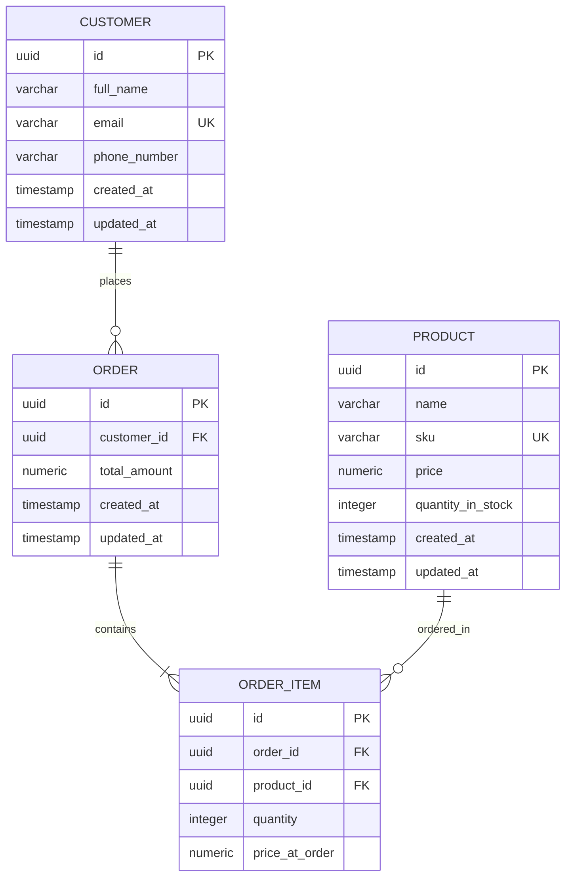

# Inventory & Order Management System Contract

This document serves as the absolute single source of truth for the Inventory & Order Management System. It specifies the architecture, folder structure, database schema, API contracts, business rules, and deployment requirements. Any modification to the core system must be reflected here first.

---

## 1. Project Description & Goals

The Inventory & Order Management System is a lightweight, containerized, and production-ready full-stack application designed to manage business inventories, customer registers, and order transactions. 

### Key Goals:
- **Accuracy & Integrity**: Guarantee that stock levels can never go negative, and all transactions are fully atomic.
- **Visual Excellence**: Provide a highly polished React UI utilizing vanilla CSS, responsive layouts, sleek dark-mode accents, glassmorphism, and clear alerts.
- **Portability**: Containerize all services using Docker and Docker Compose so the system runs identically in development and production environments.
- **Production-Ready Deployments**: Host the backend API on Railway, the frontend SPA on Vercel, and persist data in a managed PostgreSQL instance.

---

## 2. Tech Stack & Software Versions

| Layer | Technology | Version | Notes / Specifications |
| :--- | :--- | :--- | :--- |
| **OS** | Windows | 10+ / Linux | Dev Environment: Windows 10 |
| **Backend** | Python / FastAPI | 3.12+ / 0.110+ | Fast, asynchronous, auto-generated OpenAPI docs |
| **Frontend** | React (Vite) / JS | 18.3+ / Vite 5.2+ | Vanilla CSS modules, responsive design, Inter font |
| **Database** | PostgreSQL | 16-alpine | Relational database with strict check constraints |
| **Containerization**| Docker / Compose | Engine v25+, Compose v2.20+ | Production-ready, non-root users, multi-stage builds |
| **Deployment** | Railway + Vercel | Free Tier | Publicly accessible, SSL-enabled |

---

## 3. Folder Structure (Condensed)

```
inventory-system/
├── CONTRACT.md                     # This architectural contract
├── docker-compose.yml              # Local orchestration (db + backend + frontend)
├── README.md                       # High-level overview & setup instructions
├── backend/
│   ├── Dockerfile                  # Production multi-stage Docker build
│   ├── .dockerignore               # Backend files to exclude from Docker build
│   ├── requirements.txt            # Python dependencies (fastapi, uvicorn, sqlalchemy, psycopg2-binary, pydantic)
│   ├── .env.example                # Example environment variables
│   └── app/
│       ├── __init__.py
│       ├── main.py                 # FastAPI application entrypoint
│       ├── config.py               # Pydantic Settings configuration
│       ├── database.py             # SQLAlchemy session and engine configuration
│       ├── models/                 # SQLAlchemy DB models
│       │   ├── __init__.py
│       │   ├── base.py             # Base model class
│       │   ├── customer.py
│       │   ├── product.py
│       │   ├── order.py
│       │   └── order_item.py
│       ├── schemas/                # Pydantic schemas (request/response validation)
│       │   ├── __init__.py
│       │   ├── customer.py
│       │   ├── product.py
│       │   └── order.py
│       ├── routers/                # API route controllers
│       │   ├── __init__.py
│       │   ├── customers.py
│       │   ├── products.py
│       │   └── orders.py
│       └── services/               # Core business logic layer (atomic transactions)
│           ├── __init__.py
│           ├── order_service.py
│           └── inventory_service.py
└── frontend/
    ├── Dockerfile                  # Nginx-based production React build
    ├── .dockerignore               # Frontend files to exclude from Docker build
    ├── package.json
    ├── vite.config.js              # Vite bundler configuration
    ├── index.html
    ├── .env.example                # Frontend environment variables
    └── src/
        ├── main.jsx                # Application root mounting
        ├── index.css               # Global CSS variables, fonts, reset, and base styles
        ├── App.jsx                 # Routing and navigation structure
        ├── components/
        │   ├── common/
        │   │   ├── Layout.jsx      # Navigation header & viewport shell
        │   │   ├── Sidebar.jsx     # Responsive main sidebar navigation
        │   │   ├── StatsCard.jsx   # Micro-animated dashboard metric card
        │   │   └── Toast.jsx       # Alert notifications toast component
        │   ├── dashboard/
        │   │   └── DashboardView.jsx # Summary analytics page
        │   ├── products/
        │   │   ├── ProductList.jsx # Product inventory management table
        │   │   └── ProductForm.jsx # Add/Edit product modal/form
        │   ├── customers/
        │   │   ├── CustomerList.jsx # Customer registry list
        │   │   └── CustomerForm.jsx # Add customer modal/form
        │   └── orders/
        │       ├── OrderList.jsx   # Order history view
        │       ├── OrderForm.jsx   # Dynamic interactive multi-item order drawer
        │       └── OrderDetailModal.jsx # Order itemization details modal
        ├── hooks/
        │   └── useFetch.js         # Custom hook for safe API requests
        ├── services/
        │   └── api.js              # Axios-based API client wrappers
        └── utils/
            └── formatters.js       # Currencies and dates helper methods
```

---

## 4. Database Schema

The schema enforces data integrity at the database engine level via primary keys, foreign keys with restrict cascades, unique constraints, and check constraints. All identifiers use UUIDs to prevent enumeration attacks and ensure scalability.



### 4.1 Tables DDL Specifications

#### `customers`
- **Columns**:
  - `id`: `UUID` (PK, Default: `gen_random_uuid()`)
  - `full_name`: `VARCHAR(255)` (NOT NULL)
  - `email`: `VARCHAR(255)` (NOT NULL, UNIQUE)
  - `phone_number`: `VARCHAR(50)` (NOT NULL)
  - `created_at`: `TIMESTAMP WITH TIME ZONE` (NOT NULL, Default: `CURRENT_TIMESTAMP`)
  - `updated_at`: `TIMESTAMP WITH TIME ZONE` (NOT NULL, Default: `CURRENT_TIMESTAMP`)
- **Indexes**:
  - Unique B-Tree index on `email` (auto-created by UNIQUE constraint).

#### `products`
- **Columns**:
  - `id`: `UUID` (PK, Default: `gen_random_uuid()`)
  - `name`: `VARCHAR(255)` (NOT NULL)
  - `sku`: `VARCHAR(50)` (NOT NULL, UNIQUE)
  - `price`: `NUMERIC(10, 2)` (NOT NULL, CHECK: `price >= 0.00`)
  - `quantity_in_stock`: `INTEGER` (NOT NULL, CHECK: `quantity_in_stock >= 0`)
  - `created_at`: `TIMESTAMP WITH TIME ZONE` (NOT NULL, Default: `CURRENT_TIMESTAMP`)
  - `updated_at`: `TIMESTAMP WITH TIME ZONE` (NOT NULL, Default: `CURRENT_TIMESTAMP`)
- **Indexes**:
  - Unique B-Tree index on `sku` (auto-created by UNIQUE constraint).
  - CHECK constraint `chk_quantity_non_negative`: `quantity_in_stock >= 0`.

#### `orders`
- **Columns**:
  - `id`: `UUID` (PK, Default: `gen_random_uuid()`)
  - `customer_id`: `UUID` (NOT NULL, FK referencing `customers(id)` ON DELETE RESTRICT)
  - `total_amount`: `NUMERIC(12, 2)` (NOT NULL, CHECK: `total_amount >= 0.00`)
  - `created_at`: `TIMESTAMP WITH TIME ZONE` (NOT NULL, Default: `CURRENT_TIMESTAMP`)
  - `updated_at`: `TIMESTAMP WITH TIME ZONE` (NOT NULL, Default: `CURRENT_TIMESTAMP`)
- **Indexes**:
  - Index on `customer_id` for fast user-order join queries.

#### `order_items`
- **Columns**:
  - `id`: `UUID` (PK, Default: `gen_random_uuid()`)
  - `order_id`: `UUID` (NOT NULL, FK referencing `orders(id)` ON DELETE CASCADE)
  - `product_id`: `UUID` (NOT NULL, FK referencing `products(id)` ON DELETE RESTRICT)
  - `quantity`: `INTEGER` (NOT NULL, CHECK: `quantity > 0`)
  - `price_at_order`: `NUMERIC(10, 2)` (NOT NULL, CHECK: `price_at_order >= 0.00`)
- **Indexes**:
  - Unique composite index on `(order_id, product_id)` to prevent duplicate item rows.
  - Index on `order_id` for direct item resolution.
  - Index on `product_id` for inventory impact queries.

---

## 5. API Endpoints Contract

All request and response bodies are JSON structured. Standard error payloads follow the schema:
`{"detail": "Error description string"}`.

### 5.1 Product Endpoints

#### `POST /api/products`
- **Description**: Add a new product to the database.
- **Request Body**:
  ```json
  {
    "name": "string (1-255 chars, required)",
    "sku": "string (unique SKU, required)",
    "price": "number (float, positive, required)",
    "quantity_in_stock": "integer (non-negative, required)"
  }
  ```
- **Responses**:
  - `201 Created`:
    ```json
    {
      "id": "uuid-string",
      "name": "string",
      "sku": "string",
      "price": 99.99,
      "quantity_in_stock": 50,
      "created_at": "ISO-TIMESTAMP",
      "updated_at": "ISO-TIMESTAMP"
    }
    ```
  - `400 Bad Request`: Validation failure (e.g. price < 0, quantity < 0).
  - `409 Conflict`: "Product with SKU {sku} already exists."

#### `GET /api/products`
- **Description**: Retrieve a list of all products.
- **Responses**:
  - `200 OK`:
    ```json
    [
      {
        "id": "uuid-string",
        "name": "string",
        "sku": "string",
        "price": 99.99,
        "quantity_in_stock": 50
      }
    ]
    ```

#### `GET /api/products/{id}`
- **Description**: Retrieve details of a single product.
- **Responses**:
  - `200 OK`: Product object.
  - `404 Not Found`: "Product with ID {id} not found."

#### `PUT /api/products/{id}`
- **Description**: Update an existing product.
- **Request Body**:
  ```json
  {
    "name": "string (optional)",
    "sku": "string (optional)",
    "price": "number (optional)",
    "quantity_in_stock": "integer (optional)"
  }
  ```
- **Responses**:
  - `200 OK`: Updated product object.
  - `400 Bad Request`: Validation failure.
  - `404 Not Found`: "Product with ID {id} not found."
  - `409 Conflict`: "Product with SKU {sku} already exists."

#### `DELETE /api/products/{id}`
- **Description**: Delete a product. Can only be done if it has never been ordered.
- **Responses**:
  - `204 No Content`: Product deleted successfully.
  - `400 Bad Request`: "Cannot delete product because it is referenced in existing orders." (ON DELETE RESTRICT violation)
  - `404 Not Found`: "Product with ID {id} not found."

---

### 5.2 Customer Endpoints

#### `POST /api/customers`
- **Description**: Register a new customer.
- **Request Body**:
  ```json
  {
    "full_name": "string (required)",
    "email": "string (valid email format, unique, required)",
    "phone_number": "string (required)"
  }
  ```
- **Responses**:
  - `201 Created`:
    ```json
    {
      "id": "uuid-string",
      "full_name": "string",
      "email": "string",
      "phone_number": "string",
      "created_at": "ISO-TIMESTAMP",
      "updated_at": "ISO-TIMESTAMP"
    }
    ```
  - `400 Bad Request`: Validation failure.
  - `409 Conflict`: "Customer with email {email} already exists."

#### `GET /api/customers`
- **Description**: Retrieve a list of all customers.
- **Responses**:
  - `200 OK`: Array of customer objects.

#### `GET /api/customers/{id}`
- **Description**: Retrieve customer details.
- **Responses**:
  - `200 OK`: Customer object.
  - `404 Not Found`: "Customer with ID {id} not found."

#### `DELETE /api/customers/{id}`
- **Description**: Remove a customer.
- **Responses**:
  - `204 No Content`: Deleted successfully.
  - `400 Bad Request`: "Cannot delete customer with active order history." (ON DELETE RESTRICT violation)
  - `404 Not Found`: "Customer with ID {id} not found."

---

### 5.3 Order Endpoints

#### `POST /api/orders`
- **Description**: Create a new order. Triggers inventory check and atomic stock deduction inside a DB transaction block.
- **Request Body**:
  ```json
  {
    "customer_id": "uuid-string (required)",
    "items": [
      {
        "product_id": "uuid-string (required)",
        "quantity": "integer (must be >= 1, required)"
      }
    ]
  }
  ```
- **Responses**:
  - `201 Created`:
    ```json
    {
      "id": "uuid-string",
      "customer_id": "uuid-string",
      "total_amount": 149.98,
      "created_at": "ISO-TIMESTAMP",
      "items": [
        {
          "product_id": "uuid-string",
          "quantity": 2,
          "price_at_order": 74.99
        }
      ]
    }
    ```
  - `400 Bad Request`: 
    - "Customer with ID {customer_id} does not exist."
    - "Product with ID {product_id} does not exist."
    - "Insufficient stock for product '{product_name}'. Requested {qty}, available {available}."
  - `422 Unprocessable Entity`: Schema/Validation error.

#### `GET /api/orders`
- **Description**: Retrieve a list of all orders with customer details.
- **Responses**:
  - `200 OK`:
    ```json
    [
      {
        "id": "uuid-string",
        "customer_id": "uuid-string",
        "customer_name": "John Doe",
        "total_amount": 149.98,
        "created_at": "ISO-TIMESTAMP",
        "items_count": 1
      }
    ]
    ```

#### `GET /api/orders/{id}`
- **Description**: Retrieve full order details including line item details.
- **Responses**:
  - `200 OK`:
    ```json
    {
      "id": "uuid-string",
      "customer": {
        "id": "uuid-string",
        "full_name": "John Doe",
        "email": "john@example.com"
      },
      "total_amount": 149.98,
      "created_at": "ISO-TIMESTAMP",
      "items": [
        {
          "id": "uuid-string",
          "product_id": "uuid-string",
          "product_name": "Wireless Headphones",
          "sku": "HEAD-WRL-01",
          "quantity": 2,
          "price_at_order": 74.99,
          "subtotal": 149.98
        }
      ]
    }
    ```
  - `404 Not Found`: "Order with ID {id} not found."

#### `DELETE /api/orders/{id}`
- **Description**: Cancel/Delete an order. Restores the stock levels of all contained products atomically.
- **Responses**:
  - `204 No Content`: Order deleted and inventory restocked successfully.
  - `404 Not Found`: "Order with ID {id} not found."

---

### 5.4 Dashboard Endpoints

#### `GET /api/dashboard/summary`
- **Description**: Aggregates statistical metrics for the dashboard view.
- **Responses**:
  - `200 OK`:
    ```json
    {
      "total_products": 42,
      "total_customers": 18,
      "total_orders": 89,
      "low_stock_products": [
        {
          "id": "uuid-string",
          "name": "Product Name",
          "sku": "SKU-CODE",
          "quantity_in_stock": 3,
          "price": 19.99
        }
      ]
    }
    ```

---

## 6. Business Rules

The following core business rules are strictly enforced and cannot be overridden:

1. **Unique SKUs**: Every product added or updated must have a unique SKU value. Violations must trigger a `409 Conflict` response.
2. **Unique Emails**: Every customer must have a unique email address. Violations must trigger a `409 Conflict` response.
3. **Non-Negative Stock**: The `quantity_in_stock` column for any product cannot drop below `0`. Checked at the database level via a check constraint, and validated in code.
4. **Order Stock Validation**: An order cannot be placed if the requested quantity of any product exceeds its current `quantity_in_stock`.
5. **Atomic Stock Reduction**: Creating an order must execute within a database transaction block. If all items are available, stock is reduced and the order is saved. If any item fails validation, the entire transaction is rolled back, leaving inventory unchanged.
6. **Order Reversal Restoration**: Deleting an order must restore the stock level of all products in the order. This operation must also run atomically within a transaction block.
7. **Total Amount Calculation**: The `total_amount` of an order is strictly computed on the backend as `Sum(item.quantity * product.price)` at the time of creation. Submittals specifying manual totals from the client are ignored/overridden.
8. **Historical Pricing Integrity**: Order item rows must copy and persist the product's current unit price as `price_at_order`. Subsequent price changes to the product will not affect already completed orders.

---

## 7. Session Handoff Briefing

The project is initialized as a containerized FastAPI backend and React frontend workspace. Both backend/ and frontend/ folders are currently empty shells ready to receive implementation files. The project relies on PostgreSQL as a database, and will be deployed to Railway (backend + DB) and Vercel (frontend). The `CONTRACT.md` file serves as the architecture blueprint. The next immediate step is to build the backend codebase (fastapi initialization, models, database connection, schemas, and endpoints) and prepare the database migrations or creation scripts, followed by the frontend implementation and Docker containerization.
